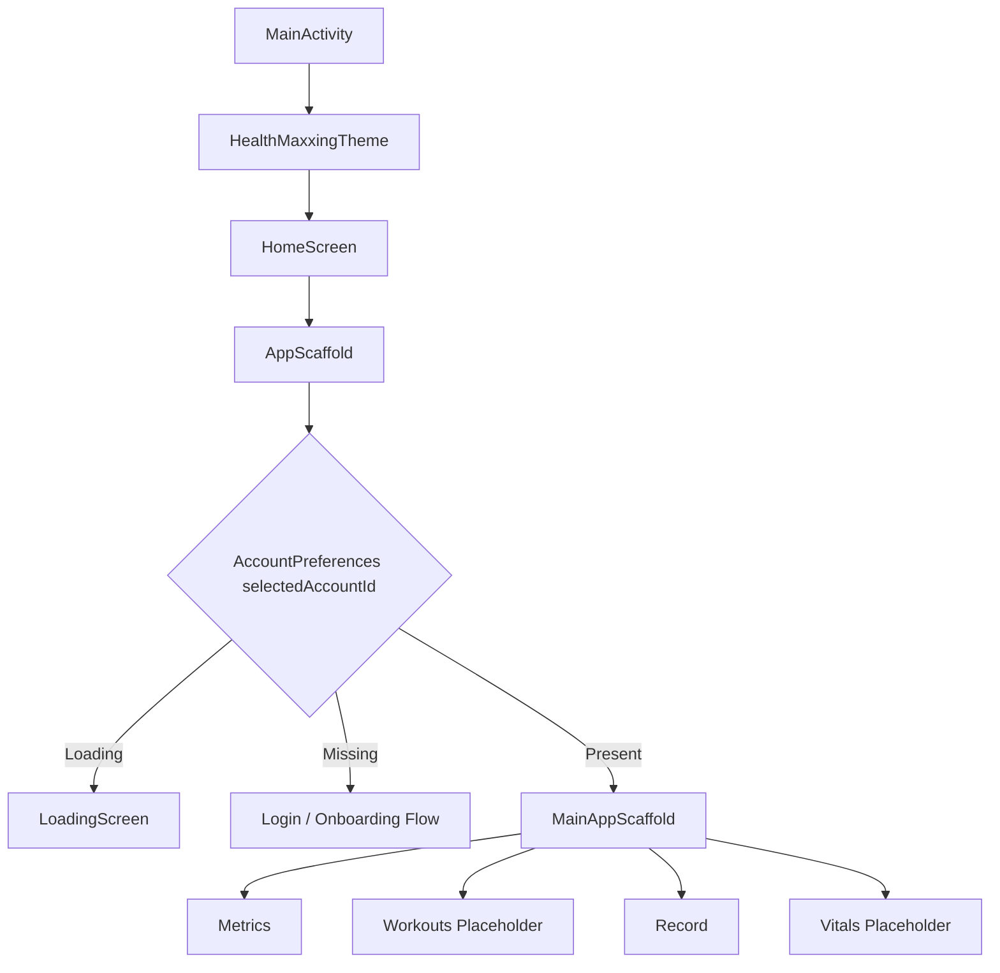
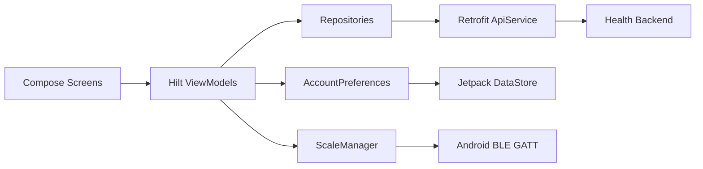

# HealthMaxxing

HealthMaxxing is a native Android health analytics app built with Kotlin and Jetpack Compose. The app, currently branded in Android resources as **Forma**, combines onboarding, profile persistence, backend-driven body-composition dashboards, and direct Bluetooth Low Energy smart-scale measurement capture.

The project is structured as a modern single-module Android application using MVVM, Hilt dependency injection, Retrofit networking, Kotlin coroutines/Flow, and Jetpack DataStore. Its main user flow is:

1. Register an account with an email address.
2. Create a primary health profile with height, date of birth, gender, and body type.
3. Persist the selected account/profile locally.
4. Load dashboard metrics from the backend.
5. Record live measurements from a compatible BLE smart scale.
6. Submit completed measurements back to the backend.

## Table Of Contents

- [Project Status](#project-status)
- [Features](#features)
- [Application Flow](#application-flow)
- [Architecture](#architecture)
- [Tech Stack](#tech-stack)
- [Project Structure](#project-structure)
- [Backend Integration](#backend-integration)
- [Bluetooth Scale Integration](#bluetooth-scale-integration)
- [Local Persistence](#local-persistence)
- [Permissions](#permissions)
- [Setup](#setup)
- [Build And Test](#build-and-test)
- [Configuration Notes](#configuration-notes)
- [Known Limitations](#known-limitations)
- [Roadmap](#roadmap)

## Project Status

HealthMaxxing is under active development. The implemented app includes onboarding, account/profile persistence, a dashboard shell, metric tabs, backend data loading, pull-to-refresh, BLE scale reading, and measurement upload.

The bottom navigation includes four destinations:

| Destination | Status | Notes |
| --- | --- | --- |
| Metrics | Implemented | Loads insights, essentials, performance, fat, and muscle dashboard data. |
| Workouts | Placeholder | Navigation destination exists, but the screen currently renders placeholder text. |
| Record | Implemented | Reads compatible BLE scale packets and posts completed measurements. |
| Vitals | Placeholder | Navigation destination exists, but the screen currently renders placeholder text. |

## Features

### Account And Profile Onboarding

- Email-based account registration through the backend.
- Primary profile creation through a multi-step Compose onboarding flow.
- Profile metadata submission, including height, date of birth, gender, and body type.
- Automatic transition from onboarding to the main app once account/profile identifiers are saved.
- Persistent account/profile selection using Jetpack DataStore Preferences.

### Metrics Dashboard

The Metrics screen uses a scrollable tab interface with pull-to-refresh. It currently exposes:

- **Insights**: Backend-provided overview, foundation insight, momentum insight, biggest lever, physique archetype, effort score, and momentum trend graph.
- **Essentials**: Forma score, body age, real age, current/goal/average weight, composition summary, body measurements, and recent weight trend data.
- **Performance**: FFMI/FMI values, lean/fat mass data, excess fat gauge data, body ratios, composition trends, and backend comments.
- **Fat**: Backend-driven fat metrics represented through a `JsonObject` response and mapped into UI state.
- **Muscle**: Backend-driven muscle metrics represented through a `JsonObject` response and mapped into UI state.
- **Lean Mass, Protein, Hydration**: Placeholder detail cards.

### Smart Scale Recording

The Record screen provides:

- Runtime Bluetooth permission handling.
- BLE connection to a configured smart scale.
- Live weight display while scale packets stream in.
- Heart rate and impedance display when available.
- Final-measurement detection.
- Measurement upload to the backend using the selected primary profile.
- User-facing status and error states for permission, connection, missing profile, missing weight, and upload failures.

### UI And Design

- Fully Compose-based UI.
- Material 3 components.
- Edge-to-edge activity setup.
- Custom typography using bundled Manrope and Cormorant Garamond fonts.
- Custom vector and bitmap assets for branding, loading, body/physique visuals, charts, and launcher icons.
- Animated loading logo while account state is being resolved.

## Application Flow



`AppScaffold` is the app gatekeeper. It observes `AccountViewModel.accountState`, which is derived from `AccountPreferences.selectedAccountId`. If no account is stored, the onboarding UI is shown. If an account exists, the main navigation shell is shown.

## Architecture

The app follows a pragmatic MVVM structure:



### UI Layer

The UI layer lives under:

```text
app/src/main/java/com/aneesh/healthmaxxing/ui
```

Important entry points:

- `MainActivity.kt`: Enables edge-to-edge rendering and mounts the Compose app.
- `HomeScreen.kt`: Thin wrapper around `AppScaffold`.
- `AppScaffold.kt`: Handles loading, logged-out, and logged-in app states.
- `Metrics.kt`: Metrics screen coordinator and pull-to-refresh host.
- `RecordScreen.kt`: BLE measurement UI.
- `login/`: Multi-step onboarding screens and registration view model.

### ViewModel Layer

ViewModels expose screen state through Compose state or `StateFlow`:

- `AccountViewModel`: Converts persisted account ID into `Loading`, `LoggedOut`, or `LoggedIn`.
- `LoginViewModel`: Handles account registration, profile creation, metadata submission, and local persistence.
- `InsightsViewModel`: Loads insights and follow-up trend series for momentum factors.
- `EssentialsViewModel`: Loads profile essentials.
- `PerformanceViewModel`: Loads performance analytics.
- `FatViewModel`: Loads fat metrics.
- `MuscleViewModel`: Loads muscle metrics.
- `RecordViewModel`: Coordinates BLE streaming and measurement upload.

### Repository Layer

Repository classes are intentionally thin wrappers around `ApiService`:

- `InsightsRepository`
- `EssentialsRepository`
- `PerformanceRepository`
- `FatRepository`
- `MuscleRepository`

This keeps network calls injectable and testable while leaving response mapping close to the feature view models.

### Data Layer

The data layer includes:

- Retrofit API interface and DTOs in `data/remote`.
- DataStore-backed account preferences in `data/datastore`.
- BLE smart-scale connection and packet decoding in `data/bluetooth`.

## Tech Stack

| Area | Technology |
| --- | --- |
| Language | Kotlin 2.2.10 |
| Build System | Gradle Kotlin DSL |
| Android Gradle Plugin | 9.2.1 |
| UI | Jetpack Compose, Material 3 |
| Navigation | AndroidX Navigation Compose |
| Dependency Injection | Dagger Hilt |
| Async | Kotlin Coroutines, Flow, StateFlow |
| Networking | Retrofit 2.11, Gson converter, OkHttp |
| Local Storage | Jetpack DataStore Preferences |
| Bluetooth | Android Bluetooth GATT APIs |
| Testing | JUnit, AndroidX Test, Espresso, Compose UI Test |

Android configuration:

| Setting | Value |
| --- | --- |
| Namespace | `com.aneesh.healthmaxxing` |
| Application ID | `com.aneesh.healthmaxxing` |
| Min SDK | 30 |
| Target SDK | 36 |
| Compile SDK | 36 |
| Java/Kotlin JVM Target | 11 |
| Version | `1.0` / `versionCode = 1` |

## Project Structure

```text
.
|-- app/
|   |-- build.gradle.kts
|   `-- src/
|       |-- main/
|       |   |-- AndroidManifest.xml
|       |   |-- java/com/aneesh/healthmaxxing/
|       |   |   |-- MainActivity.kt
|       |   |   |-- HealthMaxxingApp.kt
|       |   |   |-- account/
|       |   |   |-- data/
|       |   |   |   |-- bluetooth/
|       |   |   |   |-- datastore/
|       |   |   |   `-- remote/
|       |   |   |-- navigation/
|       |   |   |-- repository/
|       |   |   `-- ui/
|       |   |       |-- login/
|       |   |       |-- metrics/
|       |   |       |-- record/
|       |   |       `-- theme/
|       |   `-- res/
|       |       |-- drawable/
|       |       |-- font/
|       |       |-- mipmap-*/
|       |       |-- values/
|       |       `-- xml/
|       |-- test/
|       `-- androidTest/
|-- gradle/
|   |-- libs.versions.toml
|   `-- wrapper/
|-- build.gradle.kts
|-- settings.gradle.kts
|-- gradle.properties
|-- gradlew
`-- gradlew.bat
```

## Backend Integration

The Retrofit service is defined in:

```text
app/src/main/java/com/aneesh/healthmaxxing/data/remote/ApiService.kt
```

The current base URL is configured in `NetworkModule`:

```kotlin
Retrofit.Builder()
    .baseUrl("http://192.168.0.99:3030/")
```

Because this is a LAN development address, the app must run on a device or emulator that can reach that host. Cleartext HTTP traffic is currently allowed through `network_security_config.xml`.

### API Endpoints Used

| Method | Path | Purpose |
| --- | --- | --- |
| `POST` | `client/register` | Create/register an account by email. |
| `POST` | `client/register/profiles` | Create a profile for an account. |
| `POST` | `client/register/metadata` | Save profile metadata. |
| `POST` | `ingest/add_measurement` | Upload a completed scale measurement. |
| `GET` | `client/profiles/{profileId}/insights` | Load insight cards and effort score. |
| `GET` | `client/body-composition/trends` | Load trend points for dashboard momentum factors. |
| `GET` | `client/profiles/{profileId}/essentials` | Load essentials dashboard data. |
| `GET` | `client/profiles/{profileId}/performance` | Load performance analytics. |
| `GET` | `client/profiles/{profileId}/fat` | Load fat-specific metrics. |
| `GET` | `client/profiles/{profileId}/muscle` | Load muscle-specific metrics. |

## Bluetooth Scale Integration

BLE scale support is implemented in:

```text
app/src/main/java/com/aneesh/healthmaxxing/data/bluetooth
```

Key files:

- `ScaleManager.kt`: Connects to the configured BLE device, discovers services, enables notifications, emits decoded measurements as a `Flow<ScaleMeasurement>`, and closes the GATT connection when complete.
- `ScalePacketDecoder.kt`: Validates and decodes scale packets.
- `ScaleMeasurement.kt`: Holds weight, heart rate, impedance, and final-measurement state.

Current BLE constants:

| Constant | Value |
| --- | --- |
| Scale MAC address | `CF:E9:4C:03:0E:56` |
| Service UUID | `0000fff0-0000-1000-8000-00805f9b34fb` |
| Notify characteristic UUID | `0000fff4-0000-1000-8000-00805f9b34fb` |
| CCCD UUID | `00002902-0000-1000-8000-00805f9b34fb` |

### Packet Decoding

`ScalePacketDecoder` supports:

- Final packet detection for the `F3 00` terminal packet.
- 11-byte packet validation.
- Packet type validation for `0xCF` and `0xCE`.
- XOR checksum validation across the first 10 bytes.
- Weight extraction from bytes 3 and 4, divided by 100 to produce kilograms.
- Heart-rate extraction from packet flags or packet data type.
- Impedance decoding with range validation between 200 and 1200 ohms.
- Carry-forward behavior, where later packets can reuse the last known weight, heart rate, or impedance if a packet omits a value.

## Local Persistence

Local account state is stored through Jetpack DataStore Preferences:

```text
app/src/main/java/com/aneesh/healthmaxxing/data/datastore/AccountPreferences.kt
```

Stored keys:

- `selected_account_id`
- `selected_primary_profile_id`

These values control whether the app shows onboarding or the authenticated dashboard and which profile ID is used for metrics and measurement uploads.

## Permissions

The app declares:

- `INTERNET`
- `ACCESS_NETWORK_STATE`
- `BLUETOOTH` for Android 11 and below
- `BLUETOOTH_ADMIN` for Android 11 and below
- `ACCESS_FINE_LOCATION` for Android 11 and below
- `BLUETOOTH_CONNECT`
- `BLUETOOTH_SCAN`

Runtime permission behavior:

- Android 12 and above: requests `BLUETOOTH_CONNECT` and `BLUETOOTH_SCAN`.
- Android 11 and below: requests `ACCESS_FINE_LOCATION`.

## Setup

### Prerequisites

- Android Studio with support for Android Gradle Plugin 9.2.1.
- JDK 11 or newer.
- Android SDK platform 36 installed.
- A physical Android device is recommended for BLE testing.
- Backend server reachable at the configured base URL.
- Compatible BLE smart scale if testing the Record screen.

### Clone And Open

```bash
git clone <repository-url>
cd HealthMaxxing
```

Open the project in Android Studio and let Gradle sync.

### Configure Backend

Update the base URL in:

```text
app/src/main/java/com/aneesh/healthmaxxing/data/remote/NetworkModule.kt
```

For a physical Android device, use a LAN IP reachable from the phone. For an emulator, use the appropriate emulator host mapping if the backend runs on the development machine.

### Run The App

From Android Studio:

1. Select the `app` configuration.
2. Choose a device or emulator.
3. Run the project.

From the command line:

```bash
./gradlew installDebug
```

On Windows PowerShell:

```powershell
.\gradlew.bat installDebug
```

## Build And Test

### Build Debug APK

```bash
./gradlew assembleDebug
```

Windows:

```powershell
.\gradlew.bat assembleDebug
```

### Run Unit Tests

```bash
./gradlew test
```

Windows:

```powershell
.\gradlew.bat test
```

### Run Instrumented Tests

Requires a connected device or running emulator:

```bash
./gradlew connectedAndroidTest
```

Windows:

```powershell
.\gradlew.bat connectedAndroidTest
```

## Configuration Notes

- The app label in `strings.xml` is currently `Forma`, while the repository/project name is `HealthMaxxing`.
- The backend URL is hardcoded in `NetworkModule`.
- The BLE scale MAC address is hardcoded in `ScaleManager`.
- Cleartext HTTP traffic is enabled for development.
- Fat and muscle endpoints currently return `JsonObject` responses rather than strongly typed DTOs.
- Workouts, Vitals, Lean Mass, Protein, and Hydration are visible as navigation/tab surfaces but are not fully implemented feature screens yet.

## Known Limitations

- No dynamic BLE scanning or device selection is implemented yet.
- The configured scale address must match the target device.
- The app depends on the configured backend for onboarding, metrics, and measurement persistence.
- There is no Room/offline cache layer for dashboard responses.
- There is no logout/account-switching UI in the current main shell.
- Release builds currently have minification disabled.
- The default generated unit and instrumented test files are present, but feature-level test coverage is still minimal.

## Roadmap

Near-term improvements that fit the current architecture:

- Move backend URL and BLE scale configuration into build config, product flavors, or a settings screen.
- Add BLE scan and pairing flow for compatible scales.
- Introduce typed DTOs for fat and muscle responses.
- Add Room caching for recent dashboard data and measurement upload retry.
- Add logout/profile switching support.
- Complete Workouts and Vitals screens.
- Add Health Connect integration for steps, sleep, heart rate, and recovery data.
- Add feature tests for packet decoding, onboarding validation, repository error handling, and record upload behavior.
- Enable release hardening with minification, shrinking, and environment-specific network security.

## License

No license file is currently included in this repository. Add one before distributing or accepting external contributions.
