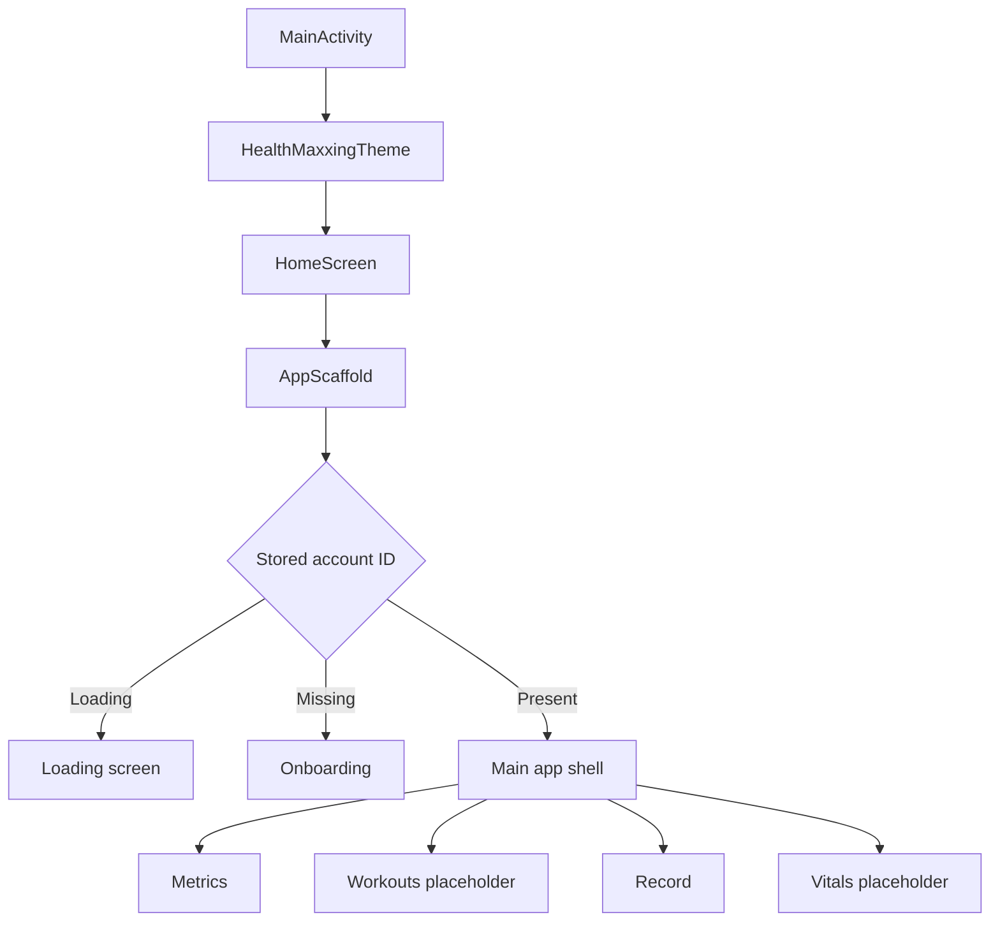
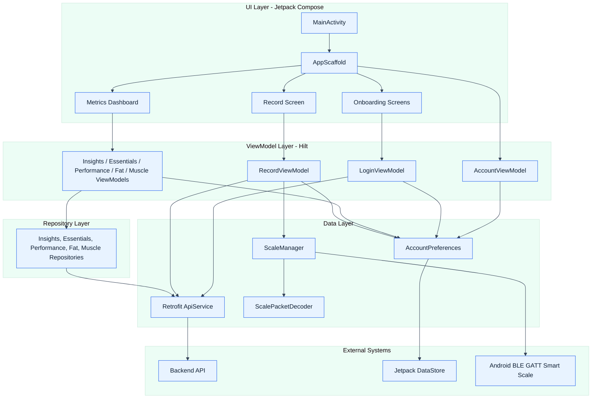

# Forma

Forma is a native Android application for body-composition tracking and health metric review. It is built with Kotlin, Jetpack Compose, Hilt, Retrofit, Kotlin coroutines, Flow, and Jetpack DataStore.

The app currently supports account onboarding, primary profile setup, backend-driven health dashboards, Bluetooth smart-scale measurement capture, and measurement upload. The Android package namespace still uses `com.aneesh.healthmaxxing`, but the product and project name is Forma.

## Contents

- [Status](#status)
- [Implemented Features](#implemented-features)
- [Metrics Shown](#metrics-shown)
- [Application Flow](#application-flow)
- [Architecture](#architecture)
- [Technology Stack](#technology-stack)
- [Project Structure](#project-structure)
- [Backend Integration](#backend-integration)
- [Bluetooth Scale Integration](#bluetooth-scale-integration)
- [Local Persistence](#local-persistence)
- [Permissions](#permissions)
- [Setup](#setup)
- [Build And Test](#build-and-test)
- [Configuration Notes](#configuration-notes)
- [Disclaimers](#disclaimers)
- [Known Limitations](#known-limitations)
- [Roadmap](#roadmap)

## Status

Forma is in active development. The production-ready surfaces today are onboarding, metric loading, metric refresh, BLE scale reading, and measurement submission. Some navigation and metric tabs are already present but still act as placeholders.

| Area | Status | Notes |
| --- | --- | --- |
| Account onboarding | Implemented | Registers an account and creates a primary profile. |
| Metrics dashboard | Implemented | Loads insights, essentials, performance, fat, and muscle data from the backend. |
| Record screen | Implemented | Reads compatible BLE scale packets and saves completed measurements. |
| Workouts | Placeholder | Destination exists in bottom navigation. |
| Vitals | Placeholder | Destination exists in bottom navigation. |
| Lean Mass / Protein / Hydration tabs | Placeholder | Tabs render informational placeholder cards. |

## Implemented Features

### Account And Profile Setup

- Email-based account registration.
- Primary profile creation.
- Profile metadata submission for height, date of birth, gender, and body type.
- Automatic transition into the main app after account and profile identifiers are stored.
- Local account/profile persistence through DataStore Preferences.

### Metrics Dashboard

- Scrollable metric tab layout.
- Pull-to-refresh across all implemented metric view models.
- Loading, error, and empty states for backend-driven data.
- Backend comments and remarks surfaced in several metric cards.
- 30-day trend rendering where trend data is available.

### Measurement Recording

- Runtime Bluetooth permission requests.
- Direct BLE GATT connection to a configured smart scale.
- Live weight updates while packets stream.
- Heart rate and impedance extraction when provided by the scale.
- Final measurement detection.
- Measurement upload using the selected primary profile ID.
- User-visible status and error handling for permission, connection, missing profile, missing weight, and backend upload failures.

## Metrics Shown

The app displays a mix of backend-calculated metrics, smart-scale readings, and short explanatory comments. The following list summarizes the metrics currently represented in the app.

### Insights

The Insights tab presents backend-generated narrative analysis:

| Metric / Section | Summary |
| --- | --- |
| Overview | High-level assessment of the current profile state. |
| Foundation | Baseline interpretation of body composition and current condition. |
| Momentum | Directional analysis based on recent changes and trend factors. |
| Biggest Lever | The highest-impact area to focus on next. |
| Physique Archetype | Backend classification used to describe the current physique profile. |
| Effort Score | Numeric score with a short remark describing consistency or progress quality. |
| Momentum Trends | Multi-line chart for the trend factors returned by the backend. |

### Essentials

The Essentials tab focuses on broad profile health and weight context:

| Metric | Summary |
| --- | --- |
| Forma Score | Overall score returned by the backend with a short remark. |
| Body Age | Estimated body age from profile and body-composition data. |
| Real Age | Chronological age used for comparison with body age. |
| Current Weight | Most recent body weight. |
| Goal Weight | Target body weight configured or calculated by the backend. |
| Average Weight 30d | Average weight across the recent 30-day window. |
| Lowest Weight 30d | Lowest weight recorded in the recent 30-day window. |
| Weight Trend | Recent weight points used for charting and trend context. |
| Composition Summary | Body fat, lean mass, protein, hydration, muscle mass, and composition score. |
| Body Measurements | Neck, shoulder, chest, stomach, waist, calf, thigh, bicep, and forearm measurements. |

### Performance

The Performance tab focuses on body-composition quality and physique ratios:

| Metric | Summary |
| --- | --- |
| FFMI | Fat-Free Mass Index, used to compare lean mass relative to height. |
| FMI | Fat Mass Index, used to compare fat mass relative to height. |
| Lean Mass | Current lean mass in kilograms. |
| Fat Mass | Current fat mass in kilograms. |
| Lean/Fat Trends | 30-day movement for lean mass and fat mass. |
| Target / Current / Initial Composition | Comparison of fat and lean mass across target, current, and initial states. |
| Excess Fat | Estimated excess fat above target fat mass. |
| Waist-to-Height Ratio | Central body ratio used as a body-composition indicator. |
| Shoulder-to-Waist Ratio | Upper-body-to-waist proportion indicator. |
| Chest-to-Waist Ratio | Torso proportion indicator. |
| Bicep-to-Forearm Ratio | Arm proportion indicator. |
| Thigh-to-Calf Ratio | Lower-body proportion indicator. |
| Neck-to-Calf Ratio | Symmetry/proportion indicator. |

### Fat

The Fat tab focuses on fat distribution and recent fat changes:

| Metric | Summary |
| --- | --- |
| Fat Ratio / Body Fat % | Percentage of total body weight represented by fat. |
| Fat Mass | Absolute fat mass in kilograms. |
| Visceral Fat | Fat stored around internal organs, shown as mass or index depending on backend data. |
| Visceral Fat % | Percentage-based visceral fat value when provided. |
| Subcutaneous Fat % | Percentage of fat stored under the skin. |
| Subcutaneous Fat Mass | Absolute subcutaneous fat mass in kilograms. |
| Visceral vs Subcutaneous Delta | Recent 30-day movement comparing visceral and subcutaneous fat changes. |
| Fat Trends | 30-day charts for available fat metrics. |

### Muscle

The Muscle tab focuses on muscle, skeletal muscle, and bone-related composition:

| Metric | Summary |
| --- | --- |
| Total Muscle Mass | Total muscle mass, including skeletal and other muscle-related mass components. |
| Muscle Ratio | Muscle mass as a percentage of total body weight. |
| Muscle vs Rest of Body | Donut chart comparing muscle ratio against the remaining body mass. |
| Bone Mass | Estimated mineral mass of bones. |
| Skeletal Muscle Mass | Muscle attached to bones and most directly affected by strength training. |
| Skeletal Muscle Ratio | Skeletal muscle mass as a percentage of total body weight. |
| Muscle Trends | 30-day trend charts for available muscle and skeletal muscle metrics. |

### Record Screen Measurements

The Record screen shows raw values read from the smart scale before they are submitted:

| Measurement | Summary |
| --- | --- |
| Weight | Live and final body weight in kilograms. |
| Heart Rate | Heart rate in beats per minute when included in the BLE packet stream. |
| Impedance | Bioelectrical impedance in ohms when included in the BLE packet stream. |

## Application Flow



`AppScaffold` controls the logged-out and logged-in states. It observes `AccountViewModel.accountState`, which is derived from the account ID stored in DataStore.

## Architecture

Forma uses a straightforward MVVM architecture with a Compose UI layer, Hilt-provided view models and repositories, and separate data sources for the backend, DataStore, and Bluetooth scale.



### UI Layer

Primary UI files are under:

```text
app/src/main/java/com/aneesh/healthmaxxing/ui
```

Key files:

- `MainActivity.kt`: Starts the Compose app.
- `HomeScreen.kt`: Delegates to `AppScaffold`.
- `AppScaffold.kt`: Handles loading, onboarding, and main navigation states.
- `metrics/`: Metric tabs, dashboard cards, charts, and metric view models.
- `record/`: Smart-scale recording UI and view model.
- `login/`: Onboarding screens and registration view model.
- `theme/`: Compose theme, colors, and typography.

### ViewModel Layer

- `AccountViewModel`: Converts stored account data into app session state.
- `LoginViewModel`: Registers account/profile data and persists identifiers.
- `InsightsViewModel`: Loads narrative insights and momentum trend data.
- `EssentialsViewModel`: Loads profile essentials.
- `PerformanceViewModel`: Loads performance analytics.
- `FatViewModel`: Loads and maps fat metrics.
- `MuscleViewModel`: Loads and maps muscle metrics.
- `RecordViewModel`: Coordinates BLE reading and measurement upload.

### Data Layer

- `ApiService.kt`: Retrofit endpoint definitions.
- `DTO.kt`: Typed request and response models for most backend endpoints.
- `NetworkModule.kt`: Hilt-provided Retrofit and API service instances.
- `AccountPreferences.kt`: DataStore-backed account/profile storage.
- `ScaleManager.kt`: BLE connection and notification flow.
- `ScalePacketDecoder.kt`: Smart-scale packet parser.

## Technology Stack

| Area | Technology |
| --- | --- |
| Language | Kotlin 2.2.10 |
| Build | Gradle Kotlin DSL |
| Android Gradle Plugin | 9.2.1 |
| UI | Jetpack Compose, Material 3 |
| Navigation | AndroidX Navigation Compose |
| Dependency Injection | Dagger Hilt |
| Async | Kotlin coroutines, Flow, StateFlow |
| Networking | Retrofit, Gson converter, OkHttp |
| Local Storage | Jetpack DataStore Preferences |
| Bluetooth | Android Bluetooth GATT APIs |
| Tests | JUnit, AndroidX Test, Espresso, Compose UI Test |

Android configuration:

| Setting | Value |
| --- | --- |
| Namespace | `com.aneesh.healthmaxxing` |
| Application ID | `com.aneesh.healthmaxxing` |
| Min SDK | 30 |
| Target SDK | 36 |
| Compile SDK | 36 |
| JVM target | 11 |
| Version | `1.0` / `versionCode = 1` |

## Project Structure

```text
.
|-- app/
|   |-- build.gradle.kts
|   `-- src/
|       |-- main/
|       |   |-- AndroidManifest.xml
|       |   |-- java/com/aneesh/healthmaxxing/
|       |   |   |-- MainActivity.kt
|       |   |   |-- HealthMaxxingApp.kt
|       |   |   |-- account/
|       |   |   |-- data/
|       |   |   |   |-- bluetooth/
|       |   |   |   |-- datastore/
|       |   |   |   `-- remote/
|       |   |   |-- navigation/
|       |   |   |-- repository/
|       |   |   `-- ui/
|       |   |       |-- login/
|       |   |       |-- metrics/
|       |   |       |-- record/
|       |   |       `-- theme/
|       |   `-- res/
|       |       |-- drawable/
|       |       |-- font/
|       |       |-- mipmap-*/
|       |       |-- values/
|       |       `-- xml/
|       |-- test/
|       `-- androidTest/
|-- gradle/
|   |-- libs.versions.toml
|   `-- wrapper/
|-- build.gradle.kts
|-- settings.gradle.kts
|-- gradle.properties
|-- gradlew
`-- gradlew.bat
```

## Backend Integration

Retrofit endpoints are defined in:

```text
app/src/main/java/com/aneesh/healthmaxxing/data/remote/ApiService.kt
```

The current development base URL is configured in:

```text
app/src/main/java/com/aneesh/healthmaxxing/data/remote/NetworkModule.kt
```

Current value:

```kotlin
Retrofit.Builder()
    .baseUrl("http://192.168.0.99:3030/")
```

The app currently allows cleartext HTTP through `network_security_config.xml`, which is appropriate for local development but should be revisited before release.

### API Endpoints

| Method | Path | Purpose |
| --- | --- | --- |
| `POST` | `client/register` | Register an account by email. |
| `POST` | `client/register/profiles` | Create a profile for an account. |
| `POST` | `client/register/metadata` | Save profile metadata. |
| `POST` | `ingest/add_measurement` | Upload a completed smart-scale measurement. |
| `GET` | `client/profiles/{profileId}/insights` | Load insight cards and effort score. |
| `GET` | `client/body-composition/trends` | Load trend points for selected metrics. |
| `GET` | `client/profiles/{profileId}/essentials` | Load essentials dashboard data. |
| `GET` | `client/profiles/{profileId}/performance` | Load performance analytics. |
| `GET` | `client/profiles/{profileId}/fat` | Load fat metrics. |
| `GET` | `client/profiles/{profileId}/muscle` | Load muscle metrics. |

## Bluetooth Scale Integration

BLE support is implemented in:

```text
app/src/main/java/com/aneesh/healthmaxxing/data/bluetooth
```

Key files:

- `ScaleManager.kt`: Connects to the configured BLE device, discovers services, enables notifications, emits measurements through `Flow<ScaleMeasurement>`, and closes the GATT connection after completion.
- `ScalePacketDecoder.kt`: Validates and decodes scale packets.
- `ScaleMeasurement.kt`: Stores weight, heart rate, impedance, and final-measurement state.

Current BLE constants:

| Constant | Value |
| --- | --- |
| Scale MAC address | `CF:E9:4C:03:0E:56` |
| Service UUID | `0000fff0-0000-1000-8000-00805f9b34fb` |
| Notify characteristic UUID | `0000fff4-0000-1000-8000-00805f9b34fb` |
| CCCD UUID | `00002902-0000-1000-8000-00805f9b34fb` |

### Packet Decoding

`ScalePacketDecoder` currently handles:

- Final packet detection for `F3 00`.
- 11-byte packet validation.
- Packet type validation for `0xCF` and `0xCE`.
- XOR checksum validation across the first 10 bytes.
- Weight extraction from bytes 3 and 4, divided by 100 to produce kilograms.
- Heart-rate extraction from packet flags or packet data type.
- Impedance decoding with range validation from 200 to 1200 ohms.
- Carry-forward behavior for fields that are missing in later packets.

## Local Persistence

Local account state is stored through DataStore Preferences in:

```text
app/src/main/java/com/aneesh/healthmaxxing/data/datastore/AccountPreferences.kt
```

Stored keys:

- `selected_account_id`
- `selected_primary_profile_id`

These values determine whether the app opens onboarding or the main dashboard, and which profile ID is used for metric requests and measurement upload.

## Permissions

Declared permissions:

- `INTERNET`
- `ACCESS_NETWORK_STATE`
- `BLUETOOTH` for Android 11 and below
- `BLUETOOTH_ADMIN` for Android 11 and below
- `ACCESS_FINE_LOCATION` for Android 11 and below
- `BLUETOOTH_CONNECT`
- `BLUETOOTH_SCAN`

Runtime permission behavior:

- Android 12 and above: `BLUETOOTH_CONNECT` and `BLUETOOTH_SCAN`.
- Android 11 and below: `ACCESS_FINE_LOCATION`.

## Setup

### Prerequisites

- Android Studio with Android Gradle Plugin 9.2.1 support.
- JDK 11 or newer.
- Android SDK platform 36.
- Backend server reachable from the emulator or device.
- Physical Android device for BLE scale testing.
- Compatible BLE smart scale for Record screen validation.

### Clone

```bash
git clone <repository-url>
cd Forma
```

Open the project in Android Studio and sync Gradle.

### Configure Backend

Update the base URL in `NetworkModule.kt` if the backend is not available at the current LAN address. For a physical device, use a LAN IP reachable by the phone. For an emulator, use the appropriate host mapping for the development machine.

### Run

From Android Studio, select the `app` configuration and run it on a device or emulator.

Command line:

```bash
./gradlew installDebug
```

Windows PowerShell:

```powershell
.\gradlew.bat installDebug
```

## Build And Test

Build a debug APK:

```bash
./gradlew assembleDebug
```

Run unit tests:

```bash
./gradlew test
```

Run instrumented tests with a connected device or emulator:

```bash
./gradlew connectedAndroidTest
```

Windows PowerShell equivalents:

```powershell
.\gradlew.bat assembleDebug
.\gradlew.bat test
.\gradlew.bat connectedAndroidTest
```

## Configuration Notes

- The project name is Forma.
- Kotlin package paths and generated identifiers still use `healthmaxxing`.
- The Compose theme class is still named `HealthMaxxingTheme`.
- The application class is still named `HealthMaxxingApp`.
- The backend URL is currently hardcoded in `NetworkModule`.
- The BLE scale MAC address is currently hardcoded in `ScaleManager`.
- Cleartext HTTP traffic is enabled for local development.
- Fat and muscle endpoints currently return `JsonObject` and are mapped manually in their view models.

## Disclaimers

Forma is provided for software, tracking, and personal information purposes only. It is not a medical device, diagnostic tool, treatment system, clinical decision support product, or replacement for advice from a qualified healthcare professional.

Health and body-composition values shown by the app may be incomplete, delayed, inaccurate, device-dependent, backend-dependent, or affected by user input, smart-scale firmware, hydration, posture, skin contact, timing, network availability, and other measurement conditions. Metrics such as body fat percentage, visceral fat, muscle mass, skeletal muscle mass, impedance, body age, effort score, and generated insights should be treated as estimates, not clinical facts.

Do not use Forma to diagnose, prevent, monitor, treat, or manage any disease, injury, medical condition, medication, diet, training program, or emergency situation. Consult a qualified medical professional before making health, nutrition, exercise, weight-loss, recovery, or lifestyle decisions based on information displayed by the app.

Backend-generated comments, scores, summaries, and recommendations are informational outputs from the configured service. They may not reflect complete medical history, lab data, wearable data, or professional judgment. The app does not guarantee that any recommendation is safe, complete, suitable, or effective for a particular user.

Bluetooth scale readings depend on third-party hardware and Android BLE behavior. Forma does not guarantee compatibility with all scales, packet formats, firmware versions, Android devices, or operating system versions. Failed readings, incorrect readings, connection loss, duplicate submissions, or missing measurements may occur.

Users and distributors are responsible for complying with applicable laws, platform policies, privacy obligations, health-data regulations, and third-party API or device terms in their jurisdiction. Do not store, transmit, or process sensitive personal data through any deployment without appropriate consent, security controls, and legal review.

To the maximum extent permitted by applicable law, Forma is provided without warranties or guarantees of any kind. The authors and copyright holders are not liable for damages, losses, health outcomes, data loss, inaccurate measurements, service interruptions, security incidents, or decisions made based on the software. The full GPL warranty disclaimer and limitation terms are available in [LICENSE](LICENSE).

## Known Limitations

- No dynamic BLE scanning or device selection.
- The scale address must match the target device.
- The app depends on the configured backend for onboarding, metrics, and measurement persistence.
- No Room or offline cache layer for dashboard responses.
- No logout or account-switching screen.
- Workouts and Vitals are placeholders.
- Lean Mass, Protein, and Hydration tabs are placeholders.
- Release builds currently have minification disabled.
- Feature-level test coverage is still limited.

## Roadmap

- Move backend URL and BLE scale configuration into build config, product flavors, or settings.
- Add BLE scan and compatible scale selection.
- Replace fat and muscle `JsonObject` parsing with typed DTOs.
- Add Room caching for dashboard data and upload retry.
- Add logout and profile switching.
- Complete Workouts and Vitals screens.
- Implement Lean Mass, Protein, and Hydration detail tabs.
- Add Health Connect support for steps, sleep, heart rate, and recovery metrics.
- Add focused tests for packet decoding, onboarding validation, repository errors, and record upload.
- Harden release networking and enable shrink/minify configuration.

## License

Forma is licensed under the GNU General Public License v3.0 or later. You may use, study, copy, modify, and distribute the software under the GPL terms, provided that derivative distributions preserve the same license obligations and include the required copyright and license notices.

See [LICENSE](LICENSE) for the full license text.
