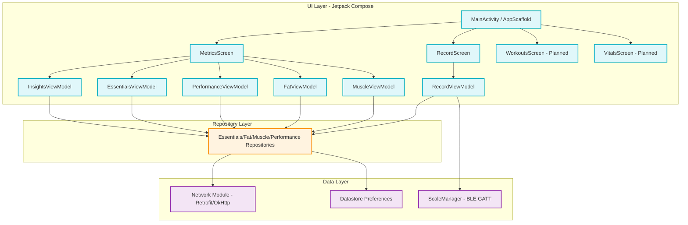
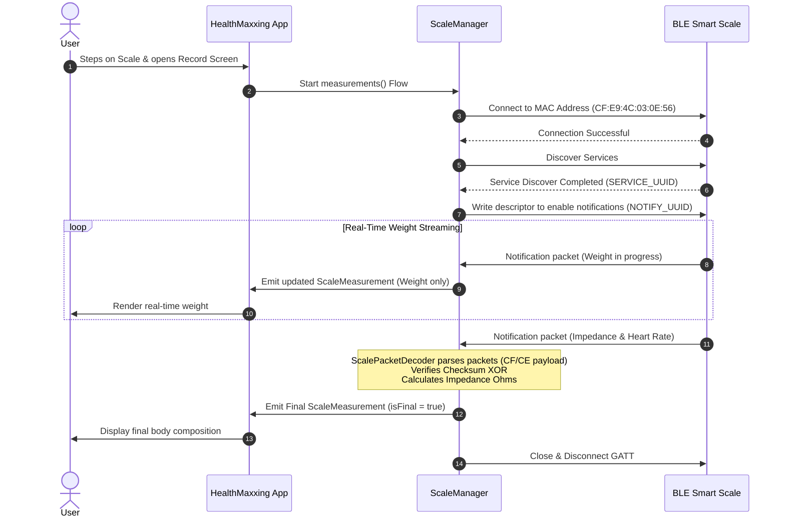
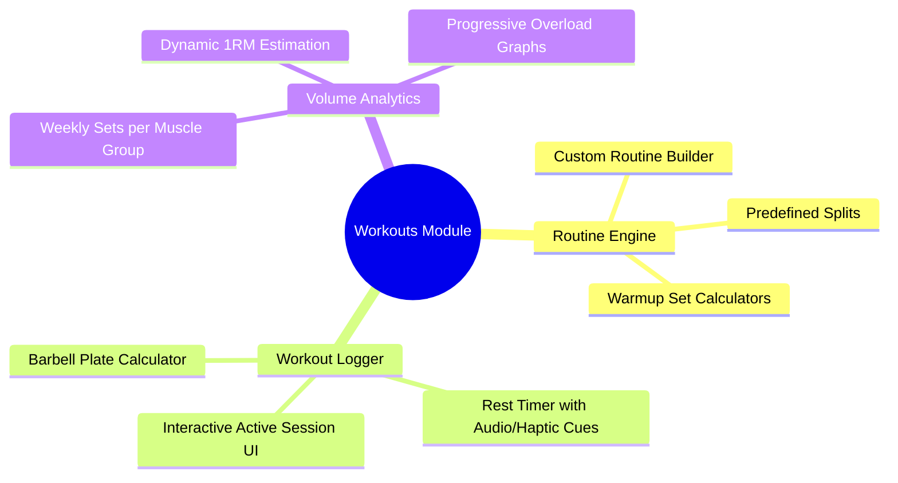
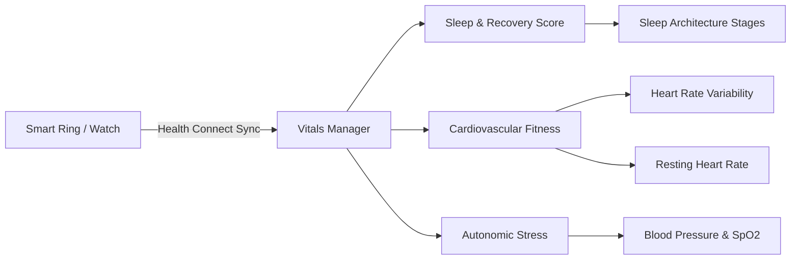

# ⚡ HealthMaxxing

[](https://developer.android.com)
[](https://kotlinlang.org)
[](https://developer.android.com/jetpack/compose)
[](https://dagger.dev/hilt/)

**HealthMaxxing** is a premium, high-performance personal health analytics dashboard designed for Android. It is engineered to help you max out your physical stats, track body composition, monitor performance metrics, and leverage AI-driven insights to achieve your physique goals.

By combining real-time Bluetooth Low Energy (BLE) smart scale synchronization with advanced body composition modeling, HealthMaxxing provides a telemetry deck for your body.

---

## 🚀 Key Features

*   **🤖 AI-Powered Insights & Telemetry**: Evaluates your metrics using advanced models to generate actionable summaries, effort scores, momentum trends, and identify your "biggest levers" for physique recomposition.
*   **📡 BLE Smart Scale Direct Sync**: Real-time connection to smart scales, parsing byte-level packets to extract body weight, heart rate, and bioelectrical impedance.
*   **📊 Multi-Dimensional Metric Dashboard**:
    *   **Essentials**: Track your overall health score (FormaScore), metabolic body age, weight trends, and full body circumferences.
    *   **Performance**: Compute advanced athletic ratios including Fat-Free Mass Index (FFMI), FMI, Lean-to-Fat distribution, and anthropometric ratios (e.g. shoulder-to-waist, chest-to-waist).
    *   **Fat & Muscle Breakdowns**: Visual gauges and charts representing Visceral Fat, Subcutaneous Fat, and Skeletal Muscle mass.
*   **🔒 Secured Local Storage**: Fast, persistent storage utilizing Jetpack DataStore Preferences for user profiles and account metadata.

---

## 🏛️ Application Architecture

HealthMaxxing is built on **Clean Architecture** principles, combining **MVVM (Model-View-ViewModel)** with Jetpack Compose. This ensures modularity, testability, and a clear separation of concerns.



---

## 📡 BLE Smart Scale Sync Engine

The app includes a custom byte packet parser specifically written to communicate with bioelectrical impedance scales. It hooks directly into the Android Bluetooth GATT profile and streams data using Kotlin `callbackFlow`.



### Packet Decoding Logic
The `ScalePacketDecoder` extracts bytes from notifications:
1. **Preamble Validation**: Expects standard headers (`0xCF` or `0xCE` packet types).
2. **XOR Checksum**: Checks that the first 10 bytes XORed match the 11th byte.
3. **Weight Decode**: Decodes two-byte raw weight values divided by 100 to get kilograms.
4. **Impedance Extraction**: Utilizes a non-linear base calibration formula to determine muscle/water resistance:
   $$\text{ohms} = \text{base} - (\text{byte}_0 \times 4 + n)$$

---

## 🏋️ Workouts Section (Planned)

The **Workouts Screen** is currently in development. It will serve as an advanced training logger designed to map how mechanical tension drives body composition improvements.



### Key Modules:
*   **Progressive Overload Telemetry**: Graphs mapping total volume load (sets × reps × weight) against corresponding increases in skeletal muscle mass.
*   **Dynamic Rest Engine**: Adaptive rest timers that scale depending on the target intensity (e.g., longer rest for heavy compounds, shorter for isolation movements).
*   **Muscular Volume Heatmaps**: Visual skeletal maps showing which muscle groups are adequately stimulated and which require more volume to max out recovery capacity.

---

## 🫁 Vitals Section (Planned)

The **Vitals Screen** is designed to collect and show systemic health indicators, tracking how well your body recovers from intense physical workloads.



### Key Modules:
*   **Google Health Connect Integration**: Seamlessly synchronize steps, sleep stages, active calories, and daily heart rate metrics from wearable devices (Fitbit, Garmin, Whoop, Apple Watch).
*   **Heart Rate Variability (HRV) Analysis**: Monitors autonomic nervous system balance to give you a daily "Readiness Score" before your workouts.
*   **Metabolic & Cardiovascular Telemetry**: Logging and tracking blood pressure trends, SpO2 levels, and resting heart rate trajectories over time.

---

## 📋 To Be Done (Roadmap)

To bring HealthMaxxing to its absolute maximum potential, the following milestones are on the roadmap:

### Phase 1: Core Functionality Enhancements
- [ ] **Dynamic BLE Scale Discovery**: Replace the hardcoded scale MAC address (`CF:E9:4C:03:0E:56`) with a BLE scanner to support connecting to any nearby compatible smart scale.
- [ ] **Offline Caching Layer**: Implement Android Room DB to cache backend insights, essentials, and composition metrics so the dashboard functions seamlessly offline.

### Phase 2: Workouts Module
- [ ] **Build Compose UI for Workouts**: Implement custom workout sessions, routine selections, and list views.
- [ ] **Volume Tracking Engine**: Implement persistent local SQL tables to record exercises, sets, reps, and completed sessions.
- [ ] **Active Workout Overlay**: Design a persistent notification or overlay timer for quick logs during active gym sessions.

### Phase 3: Vitals Module & Wearables Sync
- [ ] **Build Compose UI for Vitals**: Implement sleep metrics, daily steps, and HRV cards.
- [ ] **Google Health Connect Setup**: Add API permissions and write the sync manager that periodically pulls background sleep and heart rate data.
- [ ] **Stress/Recovery Algorithm**: Combine sleep quality, HRV, and workout volume to calculate your body's daily muscle recovery index.

---

## 🛠️ Tech Stack & Setup

*   **Min SDK**: 30 (Android 11)
*   **Target SDK**: 36 (Android 16)
*   **Jetpack Compose**: Full declarative UI built with Material Design 3.
*   **Kotlin Coroutines & Flow**: Reactive data streams for BLE updates and network requests.
*   **Dagger Hilt**: Compile-time dependency injection.
*   **Retrofit 2 & OkHttp 4**: HTTP client for API sync with JSON serialization (Gson).
*   **Jetpack DataStore**: Safe, asynchronous key-value storage.

### Local Setup
1. Clone this repository:
   ```bash
   git clone https://github.com/aneeshpatne/healthmaxxing_android.git
   ```
2. Open the project in **Android Studio (Ladybug or later)**.
3. Sync project with Gradle files.
4. Set up an emulator or connect a physical Android device.
5. Make sure Bluetooth permissions (`BLUETOOTH_CONNECT` and `ACCESS_FINE_LOCATION`) are granted when prompted on device.
6. Run the `app` module.
